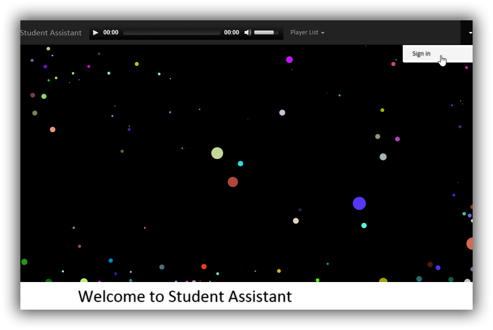
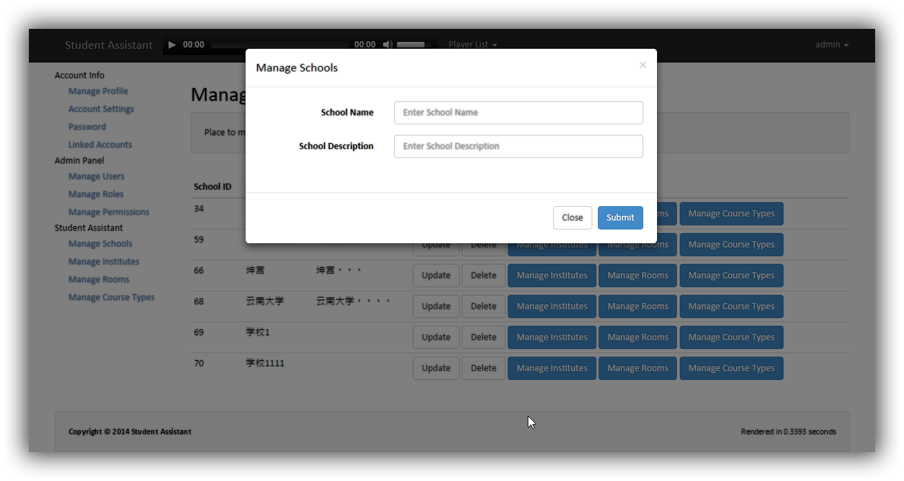
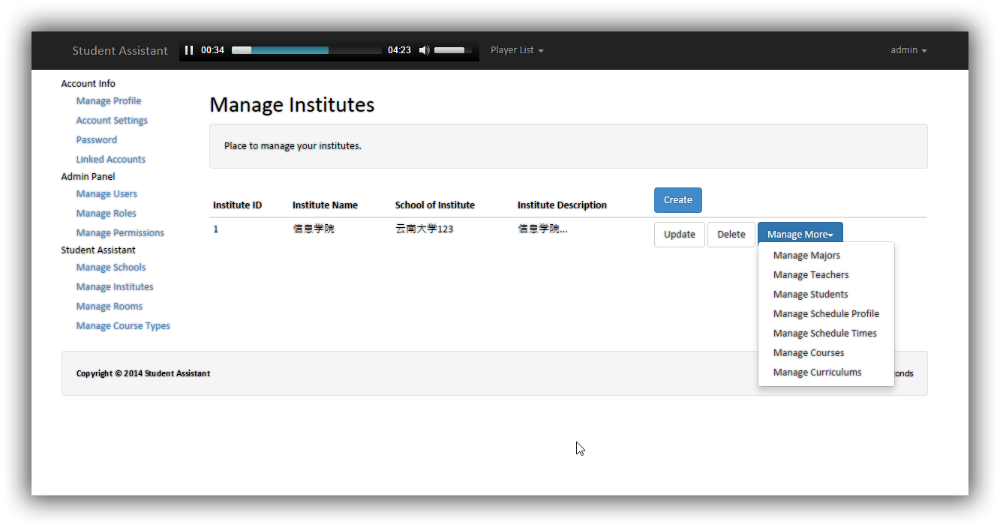
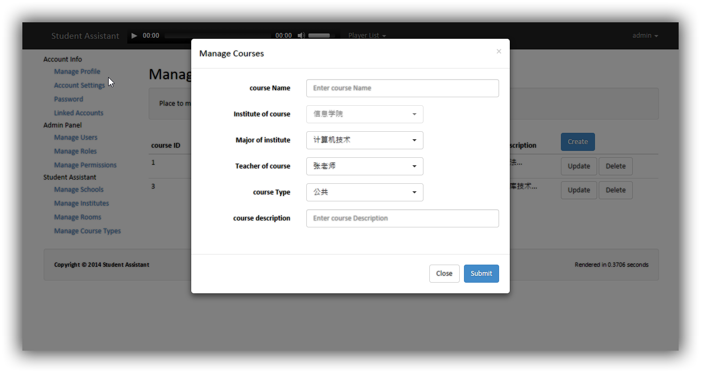

# Student assistant
### 

此项目是在A3M框架 (一个基于CodeIgniter 2.x的验证和授权的框架)基础上开发的一个课程管理系统，采用RESTFul+Ajax+Bootstrap3等技术开发。

		
## 主要功能  

* 学校管理
* 院系管理
* 教室管理 
* 课程管理
* 课程表管理
* 学生管理
* 老师管理

## 部分截图

主界面

学校管理

院系管理

课程管理

## 使用说明

* 由于使用的底层框架是一个基于CodeIgniter，其标准URL中会带有index.php，可以通过apache的mod_rewrite重写URL去除（nginx也类似，请参考nginx rewrite模块相关内容），这样可读性更好一些。如果是部署在网站根目录下，修改application/config/config.php中$config['base_url'] = 'http://localhost/', .htaccess文件中RewriteRule ^$ /index.php [L]；如果是部署在子目录下，如默认的student_assistant目录下，则不需修改，默认为：$config['base_url'] = 'http://localhost/student_assistant/'、RewriteRule ^$ /student_assistant/index.php [L] 。
* 数据库修改联系配置位于application/config/database.php文件中，注意这里的$db['default']['database'] = 'a3m';要与导入数据时创建的数据库名称一致才能连接成功
* a3m.sql为初始的一些配置信息数据及样例数据
* 默认管理员账号/密码为admin/liudonghua

## 待添加特性

* 添加Font-Awesome特性，配合Bootstrap3，如为按钮添加图标使交互更加人性化
* 更新最新的配合Bootstrap3
